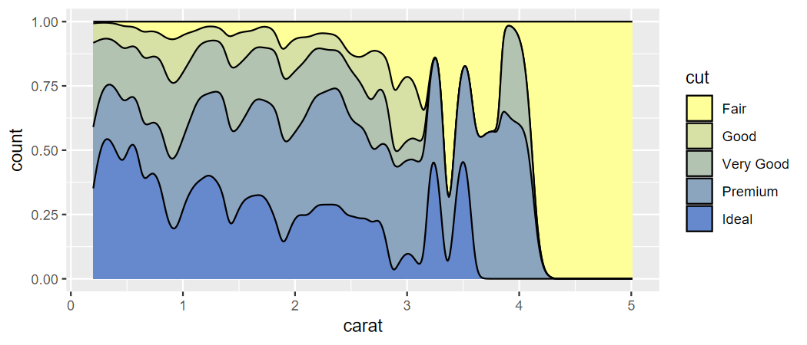
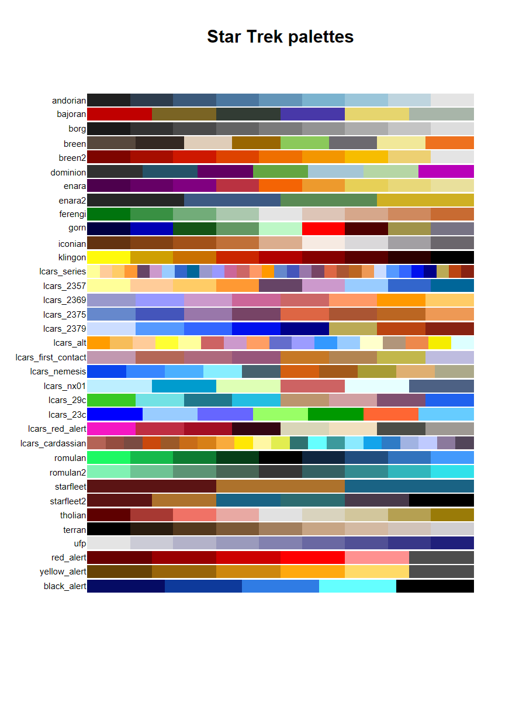

<!-- README.md is generated from README.Rmd. Please edit that file -->

# trekcolors 

**Author:** [Matthew Leonawicz](https://leonawicz.github.io/blog/)
<a href="https://orcid.org/0000-0001-9452-2771" target="orcid.widget">
<image class="orcid" src="https://members.orcid.org/sites/default/files/vector_iD_icon.svg" height="16"></a>
<br/> **License:** [MIT](https://opensource.org/licenses/MIT)<br/>

[](http://www.repostatus.org/#active)
[](https://travis-ci.org/leonawicz/trekcolors)
[](https://ci.appveyor.com/project/leonawicz/trekcolors)
[](https://codecov.io/gh/leonawicz/trekcolors?branch=master)

[](https://cran.r-project.org/package=trekcolors)
[](https://cran.r-project.org/package=trekcolors)
[](https://github.com/leonawicz/trekcolors)

The `trekcolors` package provides a collection of color palettes based
on Star Trek. It also offers functions for custom palettes and `scale_*`
functions for use with `ggplot2`.

## Installation

Install the CRAN release of `trekcolors` with

``` r
install.packages("trekcolors")
```

Install the development version from GitHub with

``` r
# install.packages("remotes")
remotes::install_github("leonawicz/trekcolors")
```

## Examples

### Basics

``` r
library(trekcolors)
library(ggplot2)

trek_pal("starfleet")
#> [1] "#5B1414" "#AD722C" "#1A6384"

trek_pal("lcars_2357")
#> [1] "#FFFF99" "#FFCC99" "#FFCC66" "#FF9933" "#664466" "#CC99CC" "#99CCFF" "#3366CC" "#006699"
lcars_pal("2357") # there are some special functions for LCARS colors
#> [1] "#FFFF99" "#FFCC99" "#FFCC66" "#FF9933" "#664466" "#CC99CC" "#99CCFF" "#3366CC" "#006699"
```

Preview the `starfleet` and `lcars_2357` palettes.

``` r
view_trek_pals(c("starfleet", "lcars_2357"))
```


### Scale functions for use with ggplot2

``` r
p <- ggplot(iris, aes(Sepal.Width, Sepal.Length, color = Species)) + 
  geom_point(size = 5, alpha = 0.75)
p + scale_color_trek() # starfleet is default palette
```


``` r

p <- ggplot(diamonds, aes(carat, price, color = clarity)) + 
  geom_point()
p + scale_color_lcars("2357") # equivalent to scale_color_trek("lcars_2357")
```


``` r

p <- ggplot(diamonds, aes(carat, stat(count), fill = cut)) +
  geom_density(position = "fill")
p + scale_fill_trek("klingon")
```


``` r
p + scale_fill_trek("romulan")
```


``` r
p + scale_fill_trek("andorian")
```


``` r

p <- ggplot(diamonds, aes(carat, stat(count), fill = cut)) +
  geom_density(position = "fill")
p + scale_fill_lcars("2357")
```


``` r
p + scale_fill_lcars1("atomic-tangerine", dark = TRUE)
```


``` r
p + scale_fill_lcars2("pale-canary", "danub")
```



``` r

d <- diamonds[diamonds$cut >= "Very Good", ]
p <- ggplot(d, aes(carat, stat(count), fill = cut)) +
  geom_density(position = "fill")
p + scale_fill_trek("starfleet")
```


### Palettes with named colors

The four LCARS palettes that have a year in their series name are
special in that these official standard LCARS colors have formal names.

``` r
# lcars_pals() # print list of all LCARS palettes

lcars_colors() # full set of unique names across the four palettes
#>      pale-canary            tanoi     golden-tanoi      neon-carrot         eggplant            lilac          anakiwa          mariner      bahama-blue        blue-bell 
#>        "#FFFF99"        "#FFCC99"        "#FFCC66"        "#FF9933"        "#664466"        "#CC99CC"        "#99CCFF"        "#3366CC"        "#006699"        "#9999CC" 
#>          melrose          hopbush    chestnut-rose      orange-peel atomic-tangerine            danub           indigo  lavender-purple           cosmic       red-damask 
#>        "#9999FF"        "#CC6699"        "#CC6666"        "#FF9966"        "#FF9900"        "#6688CC"        "#4455BB"        "#9977AA"        "#774466"        "#DD6644" 
#>   medium-carmine          bourbon      sandy-brown       periwinkle      dodger-pale      dodger-soft        near-blue        navy-blue             husk             rust 
#>        "#AA5533"        "#BB6622"        "#EE9955"        "#CCDDFF"        "#5599FF"        "#3366FF"        "#0011EE"        "#000088"        "#BBAA55"        "#BB4411" 
#>        tamarillo 
#>        "#882211"

lcars_2357() # specific color series; also 2369, 2375, 2379
#>  pale-canary        tanoi golden-tanoi  neon-carrot     eggplant        lilac      anakiwa      mariner  bahama-blue 
#>    "#FFFF99"    "#FFCC99"    "#FFCC66"    "#FF9933"    "#664466"    "#CC99CC"    "#99CCFF"    "#3366CC"    "#006699"

lcars_2357("lilac", "mariner") # select by name
#>     lilac   mariner 
#> "#CC99CC" "#3366CC"
```

### Custom palettes

In addition to these and all the other predefined palettes, custom
palettes can be constructed using official LCARS color names. This is
like `colorRampPalette` but with the ability to recognize official LCARS
color names. This functionality was leveraged by `scale_color_lcars1`
and `scale_color_lcars2` seen above when making sequential or divergent
palettes based on specific LCARS colors for use with ggplot.

``` r
lcars_custom_pal <- lcars_colors_pal(c("pale-canary", "eggplant"))
lcars_custom_pal(8)
#> [1] "#FFFF99" "#E9E491" "#D3C98A" "#BDAE83" "#A7947B" "#917974" "#7B5E6D" "#664466"

p <- ggplot(diamonds, aes(carat, stat(count), fill = cut)) +
  geom_density(position = "fill")
p + scale_fill_lcars2("pale-canary", "danub")
```


``` r

# p + scale_fill_manual(values = lcars_custom_pal(8)) # equivalent

p + scale_fill_lcars2("pale-canary", "danub", divergent = TRUE)
```


``` r
p + scale_fill_lcars2("pale-canary", "danub", dark = TRUE, divergent = TRUE)
```


### All predefined palettes

``` r
# See available palette names
trek_pal()
#>  [1] "andorian"            "bajoran"             "borg"                "breen"               "breen2"              "dominion"            "enara"              
#>  [8] "enara2"              "ferengi"             "gorn"                "iconian"             "klingon"             "lcars_series"        "lcars_2357"         
#> [15] "lcars_2369"          "lcars_2375"          "lcars_2379"          "lcars_alt"           "lcars_first_contact" "lcars_nemesis"       "lcars_nx01"         
#> [22] "lcars_29c"           "lcars_23c"           "lcars_red_alert"     "lcars_cardassian"    "romulan"             "romulan2"            "starfleet"          
#> [29] "starfleet2"          "tholian"             "terran"              "ufp"                 "red_alert"           "yellow_alert"        "black_alert"

# view all predefined palettes
view_trek_pals()
```



## Packages in the trekverse

<div class="row">

<div class="col-sm-2">

<a href="https://github.com/leonawicz/rtrek"></a>

</div>

<div class="col-sm-10">

<h4 style="padding:30px 0 0 0;margin-top:5px;margin-bottom:5px;">

<a href="https://github.com/leonawicz/rtrek">rtrek</a>: The core Star
Trek package

</h4>

Datasets related to Star Trek, API wrappers to external data sources,
and more.

</div>

</div>

<br/>

<div class="row">

<div class="col-sm-2">

<a href="https://github.com/leonawicz/lcars"></a>

</div>

<div class="col-sm-10">

<h4 style="padding:30px 0 0 0;margin-top:5px;margin-bottom:5px;">

<a href="https://github.com/leonawicz/lcars">lcars</a>: LCARS aesthetic
for Shiny

</h4>

Create Shiny apps based on the Library Computer Access/Retrieval System
(LCARS).

</div>

</div>

<br/>

<div class="row">

<div class="col-sm-2">

<a href="https://github.com/leonawicz/trekcolors"></a>

</div>

<div class="col-sm-10">

<h4 style="padding:30px 0 0 0;margin-top:5px;margin-bottom:5px;">

<a href="https://github.com/leonawicz/trekcolors">trekcolors</a>: A
color palette package

</h4>

Predefined and customizable Star Trek themed color palettes and related
functions.

</div>

</div>

<br/>

<div class="row">

<div class="col-sm-2">

<a href="https://github.com/leonawicz/trekfont"></a>

</div>

<div class="col-sm-10">

<h4 style="padding:30px 0 0 0;margin-top:5px;margin-bottom:5px;">

<a href="https://github.com/leonawicz/trekfont">trekfont</a>: A fonts
package

</h4>

True (Trek) type fonts to style your Star Trek themed graphics text.

</div>

</div>

<br>

## Citation

Matthew Leonawicz (2020). trekcolors: Star Trek Color Palettes. R
package version 0.1.2. <https://CRAN.R-project.org/package=trekcolors>

## Contribute

Contributions are welcome. Contribute through GitHub via pull request.
Please create an issue first if it is regarding any substantive feature
add or change.

If you enjoy my open source R community contributions, please consider a
donation :).

  - [Buy me a coffee in Ko-fi](https://ko-fi.com/leonawicz)
  - `leonawicz.crypto`
  - `mfl$payid.crypto.com`

-----

Please note that the `trekcolors` project is released with a
[Contributor Code of
Conduct](https://github.com/leonawicz/trekcolors/blob/master/CODE_OF_CONDUCT.md).
By contributing to this project, you agree to abide by its terms.
